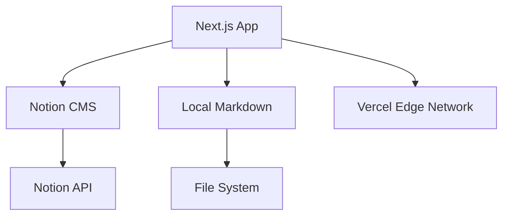

# Codebase Improvement Suggestions

## Executive Summary

This document provides comprehensive improvement suggestions for the Next.js 16 + Notion CMS blogfolio platform. The analysis covers **security**, **performance**, **code quality**, **architecture**, **documentation**, and **best practices**.

---

## 🔴 Critical Security Issues

### 1. **Exposed API Endpoint Leaking Secrets** ⚠️ CRITICAL

**File:** `app/api/secrets/route.ts`

```typescript
// CURRENT (VULNERABLE)
export async function GET() {
  return NextResponse.json({
    telegram_token: process.env.TELEGRAM_TOKEN,
    telegram_chat_id: process.env.TELEGRAM_CHAT_ID,
  })
}
```

**Problem:** This endpoint exposes sensitive Telegram credentials to ANYONE who can access it. This is a critical security vulnerability.

**Recommendation:**
- **IMMEDIATELY** remove or secure this endpoint
- Never expose environment variables containing secrets via API routes
- Use server-side only processing for Telegram integration

**Fixed Implementation:**
```typescript
// Option 1: Remove entirely and use server actions
// Option 2: Add authentication middleware
import { auth } from '@/lib/auth'; // Implement proper auth

export async function GET(request: Request) {
  const session = await auth();
  if (!session?.user?.isAdmin) {
    return NextResponse.json({ error: 'Unauthorized' }, { status: 401 });
  }
  // Only return non-sensitive config
  return NextResponse.json({ configured: !!process.env.TELEGRAM_CHAT_ID });
}
```

---

### 2. **Client-Side Fetch of Sensitive Configuration** ⚠️ HIGH

**File:** `app/contact/ContactForm.tsx` (lines 69-71)

```typescript
// CURRENT (VULNERABLE)
const secretsResponse = await fetch("/api/secrets");
const { telegram_token, telegram_chat_id } = await secretsResponse.json();
```

**Problem:** Telegram bot token is fetched client-side, exposing it to:
- Browser DevTools inspection
- Network tab monitoring
- Potential MITM attacks
- Malicious script injection

**Recommendation:**
- Move Telegram API calls to a **server action** or **API route**
- Keep all credentials server-side only

**Fixed Implementation:**
```typescript
// app/contact/actions.ts
'use server';

export async function submitContactForm(formData: FormData) {
  const telegramToken = process.env.TELEGRAM_TOKEN;
  const telegramChatId = process.env.TELEGRAM_CHAT_ID;

  if (!telegramToken || !telegramChatId) {
    throw new Error("Telegram configuration missing");
  }

  // Process and send to Telegram server-side
  // ...
}

// ContactForm.tsx
import { submitContactForm } from './actions';

const handleSubmit = async (e: React.FormEvent) => {
  e.preventDefault();
  await submitContactForm(formData);
};
```

---

### 3. **Missing Input Validation & Sanitization** ⚠️ MEDIUM-HIGH

**File:** `app/contact/ContactForm.tsx`

**Problems:**
- No email format validation beyond HTML5 `type="email"`
- No message length limits
- No rate limiting on form submissions
- Phone number accepts any format
- File upload lacks MIME type validation (only checks size)

**Recommendations:**
```typescript
// Add validation schema with Zod
import { z } from 'zod';

const contactSchema = z.object({
  name: z.string().min(2).max(100),
  email: z.string().email(),
  phone: z.string().optional().regex(/^\+?[\d\s-]{8,}$/),
  message: z.string().min(10).max(5000),
});

// Add rate limiting (e.g., with @upstash/ratelimit or custom solution)
// Validate file MIME types
const ALLOWED_MIME_TYPES = ['application/pdf', 'image/jpeg', 'image/png'];
if (!ALLOWED_MIME_TYPES.includes(file.type)) {
  toast.error("Invalid file type");
  return;
}
```

---

### 4. **TypeScript Build Errors Ignored** ⚠️ MEDIUM

**File:** `next.config.mjs`

```typescript
typescript: {
  ignoreBuildErrors: true,  // ❌ DANGEROUS
},
```

**Problem:** This allows the application to build even with TypeScript errors, potentially hiding critical type safety issues.

**Recommendation:**
```typescript
typescript: {
  ignoreBuildErrors: false,  // ✅ Enable strict type checking
},
```

Fix all existing TypeScript errors instead of ignoring them.

---

### 5. **Unoptimized Images Enabled** ⚠️ LOW-MEDIUM

**File:** `next.config.mjs`

```typescript
images: {
  unoptimized: true,  // ❌ Performance impact
  remotePatterns: [...]
},
```

**Problem:** Disables Next.js image optimization, resulting in:
- Larger image payloads
- No automatic WebP/AVIF conversion
- No responsive image srcset generation
- Slower page loads

**Recommendation:**
```typescript
images: {
  unoptimized: false,  // ✅ Enable optimization
  remotePatterns: [
    { protocol: 'https', hostname: '**.notion.so' },
    { protocol: 'https', hostname: '**.amazonaws.com' },
    // Add other required patterns
  ],
  formats: ['image/webp', 'image/avif'],
},
```

---

## 🟡 Performance Improvements

### 6. **Excessive Font Loading** ⚠️ PERFORMANCE

**File:** `app/layout.tsx` (lines 32-111)

**Problem:** Loading **13 different font families** locally:
- Increases initial bundle size
- Multiple font files block rendering
- Unused fonts waste bandwidth

**Recommendation:**
```typescript
// Reduce to essential fonts only (2-3 max)
const inter = localFont({
  src: "../public/fonts/Inter-Regular.woff2",
  variable: "--font-inter",
  display: "swap",
});

const jetbrainsMono = localFont({
  src: "../public/fonts/JetBrainsMono-Regular.woff2",
  variable: "--font-mono",
  display: "swap",
});

// In html className:
className={`${inter.variable} ${jetbrainsMono.variable}`}
```

Consider using `next/font/google` for better optimization and caching.

---

### 7. **Missing React Cache Boundaries** ⚠️ PERFORMANCE

**File:** `lib/content.ts`

**Current:** Uses `cache()` and `unstable_cache()` correctly ✅

**Additional Recommendations:**
```typescript
// Add revalidation tags for better ISR
export const getContentByType = cache(async function(type: string) {
  const fetcher = unstable_cache(
    async () => fetchNotionContentByType(type),
    [`content-list-${type}`],
    {
      revalidate: 3600,
      tags: [`content-${type}`, `global-content`] // Add global tag for bulk revalidation
    },
  );
  return fetcher();
});

// Add revalidatePath/revalidateTag calls after content updates
```

---

### 8. **Inefficient Highlighter Initialization** ⚠️ PERFORMANCE

**File:** `lib/content.ts` (lines 23-42)

**Problem:** Highlighter loads 16 languages but may not need all on every request.

**Recommendation:**
```typescript
// Lazy-load languages dynamically
async function getHighlighter() {
  if (!highlighter) {
    highlighter = await createHighlighter({
      themes: ["one-dark-pro"],
      langs: [], // Start empty
    });
  }
  return highlighter;
}

// Load language on-demand
async function highlightCode(code: string, lang: string) {
  const sh = await getHighlighter();
  if (!sh.getLoadedLanguages().includes(lang)) {
    await sh.loadLanguage(lang);
  }
  return sh.codeToHtml(code, { lang, theme: "one-dark-pro" });
}
```

---

### 9. **No CDN Strategy for Static Assets** ⚠️ PERFORMANCE

**Observation:** All fonts and images served from `/public` directory.

**Recommendations:**
- Use Vercel Blob Storage or Cloudflare R2 for media assets
- Implement proper Cache-Control headers
- Consider using `next/image` with optimized remote patterns for Notion images
- Add service worker caching strategy improvements in `public/sw.js`

---

### 10. **Large Bundle Size Risk** ⚠️ PERFORMANCE

**File:** `package.json`

**Observations:**
- 55 production dependencies
- Heavy libraries: `framer-motion`, `chart.js`, `jspdf`, `html2canvas`, `gsap`

**Recommendations:**
```json
// Analyze bundle with @next/bundle-analyzer
{
  "scripts": {
    "analyze": "ANALYZE=true next build"
  }
}
```

- Tree-shake unused Framer Motion components
- Lazy-load heavy components (charts, PDF generation)
- Consider lighter alternatives:
  - `chart.js` → `recharts` or `visx` (better React integration)
  - `jspdf` + `html2canvas` → Server-side PDF generation

---

## 🟢 Code Quality & Best Practices

### 11. **Inconsistent Error Handling** ⚠️ CODE QUALITY

**File:** `lib/notion.ts`, `lib/content.ts`

**Current Pattern:**
```typescript
catch (error) {
  console.error(`Error fetching...`, error);
  return [];  // Silently fails
}
```

**Recommendation:**
```typescript
// Implement proper error boundaries and user feedback
class NotionAPIError extends Error {
  constructor(message: string, public statusCode?: number) {
    super(message);
    this.name = 'NotionAPIError';
  }
}

catch (error) {
  logger.error('Notion fetch failed', { type, error });

  if (isNotionEnabled) {
    throw new NotionAPIError('Failed to load content', 503);
  }
  return [];
}

// Add error.tsx pages for graceful degradation
```

---

### 12. **Magic Numbers and Hardcoded Values** ⚠️ CODE QUALITY

**Files:** Multiple

**Examples:**
```typescript
const MAX_FILE_SIZE = 20 * 1024 * 1024;  // ✅ Good
const wordsPerMinute = 200;  // ❌ Magic number
revalidate: 3600  // ❌ Magic number
```

**Recommendation:**
```typescript
// lib/config.ts
export const contentConfig = {
  wordsPerMinute: 220,
  cacheRevalidation: 60 * 60, // 1 hour
  maxFileSize: 20 * 1024 * 1024,
  allowedFileTypes: ['pdf', 'jpg', 'png'],
};

// Usage
import { contentConfig } from '@/lib/config';
const readingTime = Math.ceil(words / contentConfig.wordsPerMinute);
```

---

### 13. **Typo in Filename** ⚠️ CODE QUALITY

**File:** `knowlegde.md` should be `knowledge.md`

**Recommendation:** Rename file and update any references.

---

### 14. **Missing JSDoc Documentation** ⚠️ CODE QUALITY

**Files:** Most utility functions lack documentation

**Recommendation:**
```typescript
/**
 * Extracts plain text from a Notion rich_text or title property.
 *
 * @param property - Notion property object with type and content
 * @returns Concatenated plain text from all rich text segments
 *
 * @example
 * const title = getPlainText(page.properties.Name);
 */
export function getPlainText(property: any): string {
  // ...
}
```

---

### 15. **ESLint Rules Disabled** ⚠️ CODE QUALITY

**File:** `eslint.config.mjs`

```typescript
rules: {
  'react/no-unescaped-entities': 'off',  // Why?
  '@next/next/no-page-custom-font': 'off',  // Why?
},
```

**Recommendation:**
- Document WHY rules are disabled
- Fix underlying issues instead of disabling rules
- Add more strict rules for better code quality:
```typescript
rules: {
  '@typescript-eslint/no-explicit-any': 'warn',
  '@typescript-eslint/prefer-nullish-coalescing': 'error',
  'react-hooks/exhaustive-deps': 'error',
  'no-console': ['warn', { allow: ['warn', 'error'] }],
}
```

---

### 16. **Type Safety Gaps** ⚠️ CODE QUALITY

**Files:** `lib/notion.ts`, `lib/content.ts`

**Problem:** Extensive use of `any` type:
```typescript
const { bookmark } = block as any;  // ❌
const props = page.properties;  // ❌ Implicit any
```

**Recommendation:**
```typescript
// Define proper types
interface NotionBookmarkBlock {
  bookmark: {
    url: string;
  };
}

interface NotionPageProperties {
  Name?: NotionTitleProperty;
  Slug?: NotionRichTextProperty;
  // ...
}

const { bookmark } = block as NotionBookmarkBlock;  // ✅
```

Install and configure `@notionhq/client` types properly.

---

## 🏗️ Architecture Improvements

### 17. **Monolithic Content Processing** ⚠️ ARCHITECTURE

**File:** `lib/content.ts` (1000+ lines)

**Problem:** Single file handles:
- Notion API integration
- Markdown parsing
- Syntax highlighting
- Quiz injection
- Alert transformation
- File system operations

**Recommendation:** Split into modular services:
```
lib/
├── content/
│   ├── index.ts (exports)
│   ├── notion-client.ts
│   ├── markdown-parser.ts
│   ├── syntax-highlighter.ts
│   ├── content-transformers.ts
│   └── local-storage.ts
├── validators/
│   ├── contact-form.ts
│   └── content-schema.ts
└── services/
    ├── telegram-service.ts
    └── seo-service.ts
```

---

### 18. **Missing Environment Variable Validation** ⚠️ ARCHITECTURE

**File:** Multiple files access `process.env` directly

**Recommendation:**
```typescript
// lib/env.ts
import { z } from 'zod';

const envSchema = z.object({
  NOTION_AUTH_TOKEN: z.string().min(1),
  NOTION_BLOG_ID: z.string().min(1),
  TELEGRAM_TOKEN: z.string().optional(),
  SITE_URL: z.string().url(),
  // ...
});

export const env = envSchema.parse(process.env);

// Type-safe access throughout app
import { env } from '@/lib/env';
const token = env.NOTION_AUTH_TOKEN;
```

Add `.env.example` validation in CI/CD pipeline.

---

### 19. **No Centralized Logging Strategy** ⚠️ ARCHITECTURE

**Current:** Scattered `console.error()` and `console.log()` calls

**Recommendation:**
```typescript
// lib/logger.ts
type LogLevel = 'debug' | 'info' | 'warn' | 'error';

class Logger {
  private level: LogLevel;

  constructor(level: LogLevel = process.env.NODE_ENV === 'production' ? 'warn' : 'debug') {
    this.level = level;
  }

  error(message: string, context?: Record<string, unknown>) {
    this.log('error', message, context);
    // Send to Sentry, LogRocket, etc. in production
  }

  info(message: string, context?: Record<string, unknown>) {
    this.log('info', message, context);
  }

  private log(level: LogLevel, message: string, context?: Record<string, unknown>) {
    if (this.shouldLog(level)) {
      console[level](`[${level.toUpperCase()}] ${message}`, context);
    }
  }
}

export const logger = new Logger();
```

---

### 20. **Tight Coupling Between Components** ⚠️ ARCHITECTURE

**Observation:** Direct imports between deeply nested components

**Recommendation:**
- Implement dependency injection pattern
- Use React Context for shared state (already partially done)
- Create clear separation between UI components and business logic
- Consider feature-based folder structure:
```
features/
├── blog/
│   ├── components/
│   ├── hooks/
│   ├── api/
│   └── utils/
├── contact/
└── quiz/
```

---

## 📚 Documentation Improvements

### 21. **Incomplete README** ⚠️ DOCUMENTATION

**Current:** Good overview but missing:
- Architecture diagram
- API documentation
- Contributing guidelines
- Testing instructions
- Deployment guide details

**Recommendations:**
```markdown
## Architecture



## API Routes

| Endpoint | Method | Description | Auth Required |
|----------|--------|-------------|---------------|
| `/api/secrets` | GET | ❌ DEPRECATED - Security risk | Yes |
| `/api/og` | GET | Generate OpenGraph images | No |
| `/api/author` | GET | Fetch author data | No |

## Development

### Running Tests
```bash
pnpm test
pnpm test:coverage
```

### Code Style
```bash
pnpm lint
pnpm format
```
```

---

### 22. **Missing Inline Comments for Complex Logic** ⚠️ DOCUMENTATION

**File:** `lib/content.ts` (regex patterns, quiz injection)

**Example needing comments:**
```typescript
// Current (unclear)
cleanJson = cleanJson.replace(
  /\\(["\\/bfnrt]|u[0-9a-fA-F]{4})|\\/g,
  (match: string, p1: string) => (p1 ? match : "\\\\"),
);

// Recommended
// Escape backslashes while preserving valid JSON escape sequences
// This handles edge cases where quiz JSON contains escaped characters
cleanJson = cleanJson.replace(
  /\\(["\\/bfnrt]|u[0-9a-fA-F]{4})|\\/g,
  (match: string, p1: string) => (p1 ? match : "\\\\"),
);
```

---

### 23. **No CHANGELOG** ⚠️ DOCUMENTATION

**Recommendation:** Add `CHANGELOG.md` following [Keep a Changelog](https://keepachangelog.com/) format:
```markdown
# Changelog

## [1.5.0] - 2024-01-15

### Added
- Interactive quiz component support
- GitHub-style alert blocks

### Changed
- Updated to Next.js 16.2.2
- Improved syntax highlighting performance

### Fixed
- Security vulnerability in contact form
- TypeScript build errors ignored in production

### Security
- ⚠️ Fixed critical API endpoint exposing Telegram credentials
```

---

### 24. **Missing ADR (Architecture Decision Records)** ⚠️ DOCUMENTATION

**Recommendation:** Create `docs/adr/` directory:
```
docs/
└── adr/
    ├── 001-use-nextjs-16.md
    ├── 002-notion-as-cms.md
    ├── 003-tailwind-v4.md
    └── 004-server-actions-pattern.md
```

Template:
```markdown
# ADR-001: Use Next.js 16 App Router

## Status
Accepted

## Context
Need modern React framework with SSR, ISR, and excellent DX.

## Decision
Use Next.js 16 with App Router for:
- Server Components by default
- Improved performance
- Better caching strategies

## Consequences
- Learning curve for team
- Migration from Pages Router required
- Access to latest React features
```

---

## 🔒 Security Hardening

### 25. **Content Security Policy (CSP) Missing** ⚠️ SECURITY

**Recommendation:** Add CSP headers in `next.config.mjs`:
```typescript
const securityHeaders = [
  {
    key: 'Content-Security-Policy',
    value: [
      "default-src 'self'",
      "script-src 'self' 'unsafe-inline' https://gist.github.com",
      "style-src 'self' 'unsafe-inline'",
      "img-src 'self' data: https: blob:",
      "font-src 'self' data:",
      "connect-src 'self' https://api.notion.com https://api.telegram.org",
      "frame-src 'self' https://www.youtube.com",
    ].join('; '),
  },
  {
    key: 'X-Frame-Options',
    value: 'DENY',
  },
  {
    key: 'X-Content-Type-Options',
    value: 'nosniff',
  },
  {
    key: 'Referrer-Policy',
    value: 'strict-origin-when-cross-origin',
  },
  {
    key: 'Permissions-Policy',
    value: 'camera=(), microphone=(), geolocation=()',
  },
];

module.exports = {
  async headers() {
    return [
      {
        source: '/:path*',
        headers: securityHeaders,
      },
    ];
  },
};
```

---

### 26. **No Rate Limiting** ⚠️ SECURITY

**File:** `app/api/*` routes and contact form

**Recommendation:**
```typescript
// Middleware for rate limiting
import { Ratelimit } from "@upstash/ratelimit";
import { Redis } from "@upstash/redis";

const ratelimit = new Ratelimit({
  redis: Redis.fromEnv(),
  limiter: Ratelimit.slidingWindow(10, "1 m"), // 10 requests per minute
  analytics: true,
});

// In API route or server action
export async function POST(request: Request) {
  const ip = request.headers.get("x-forwarded-for") ?? "unknown";
  const { success } = await ratelimit.limit(ip);

  if (!success) {
    return NextResponse.json(
      { error: "Too many requests" },
      { status: 429 }
    );
  }

  // Process request
}
```

---

### 27. **Sensitive Data in Client Bundle** ⚠️ SECURITY

**Check:** Ensure no `.env.local` values leak to client

**Recommendation:**
```typescript
// Add to next.config.mjs
const { withSecureHeaders } = require('next-secure-headers');

module.exports = withSecureHeaders({
  dangerouslyDisableDefaultSrcSelf: ['font-src'],
})(nextConfig);

// Audit with:
// pnpm dlx @next/codemod check .
```

---

### 28. **Dependency Vulnerabilities** ⚠️ SECURITY

**Recommendation:**
```bash
# Regular security audits
pnpm audit
pnpm audit --audit-level high

# Automate in CI/CD
# Add to .github/workflows/security.yml
name: Security Audit
on:
  push:
    paths: ['package.json', 'pnpm-lock.yaml']
  schedule:
    - cron: '0 0 * * 0'  # Weekly

jobs:
  audit:
    runs-on: ubuntu-latest
    steps:
      - uses: actions/checkout@v4
      - uses: pnpm/action-setup@v2
      - run: pnpm install --frozen-lockfile
      - run: pnpm audit --audit-level high
```

Consider using `dependabot` or `renovate` for automated updates.

---

## 🧪 Testing Strategy

### 29. **No Test Suite** ⚠️ TESTING

**Current:** Zero tests in codebase

**Recommendation:**
```json
// package.json
{
  "devDependencies": {
    "@testing-library/react": "^14.0.0",
    "@testing-library/jest-dom": "^6.0.0",
    "@vitest/coverage-v8": "^1.0.0",
    "vitest": "^1.0.0",
    "playwright": "^1.40.0"
  },
  "scripts": {
    "test": "vitest",
    "test:ui": "vitest --ui",
    "test:e2e": "playwright test",
    "test:coverage": "vitest --coverage"
  }
}
```

**Test Structure:**
```
__tests__/
├── unit/
│   ├── content.test.ts
│   ├── notion.test.ts
│   └── utils.test.ts
├── components/
│   ├── ContactForm.test.tsx
│   └── Navigation.test.tsx
└── e2e/
    ├── contact-form.spec.ts
    └── navigation.spec.ts
```

**Example Test:**
```typescript
// __tests__/unit/content.test.ts
import { describe, it, expect, vi } from 'vitest';
import { getPlainText, getDate } from '@/lib/notion';

describe('Notion helpers', () => {
  it('should extract plain text from title property', () => {
    const property = {
      type: 'title',
      title: [{ plain_text: 'Test Title' }]
    };

    expect(getPlainText(property)).toBe('Test Title');
  });

  it('should return empty string for null property', () => {
    expect(getPlainText(null)).toBe('');
  });
});
```

---

### 30. **No Visual Regression Testing** ⚠️ TESTING

**Recommendation:**
```bash
pnpm add -D @percy/cli @percy/playwright
```

Add Percy or Chromatic for visual testing of UI components.

---

## 🚀 Performance Monitoring

### 31. **Limited Observability** ⚠️ MONITORING

**Current:** Only Vercel Speed Insights enabled

**Recommendations:**
```typescript
// Add comprehensive monitoring
import { Analytics } from "@vercel/analytics/react";
import { inject } from "@vercel/web-analytics";

// lib/monitoring.ts
export function initMonitoring() {
  // Vercel Analytics
  inject();

  // Error tracking (Sentry)
  if (process.env.NEXT_PUBLIC_SENTRY_DSN) {
    import("@sentry/nextjs").then((Sentry) => {
      Sentry.init({
        dsn: process.env.NEXT_PUBLIC_SENTRY_DSN,
        tracesSampleRate: 0.1,
        release: process.env.VERCEL_GIT_COMMIT_SHA,
      });
    });
  }

  // Custom performance metrics
  if (typeof window !== 'undefined') {
    reportWebVitals((metric) => {
      // Send to analytics endpoint
      fetch('/api/metrics', {
        method: 'POST',
        body: JSON.stringify(metric),
      });
    });
  }
}
```

---

### 32. **No Synthetic Monitoring** ⚠️ MONITORING

**Recommendation:** Set up Checkly or Pingdom for:
- Uptime monitoring
- Performance regression detection
- SSL certificate expiry alerts
- API endpoint health checks

---

## ♿ Accessibility (a11y)

### 33. **Incomplete Accessibility Implementation** ⚠️ ACCESSIBILITY

**Current:** Basic accessibility page exists but implementation gaps

**Recommendations:**
```typescript
// Add skip links
<a href="#main-content" className="sr-only focus:not-sr-only">
  Skip to main content
</a>

// Ensure all interactive elements have proper labels
<Button aria-label="Close modal">
  <XIcon />
</Button>

// Add focus management for modals
useEffect(() => {
  const previousFocus = document.activeElement;
  modalRef.current?.focus();

  return () => {
    previousFocus?.focus();
  };
}, []);

// Run automated audits
pnpm add -D axe-core @axe-core/react
```

**Add to CI/CD:**
```yaml
- name: Accessibility Audit
  run: npx pa11y-ci
```

---

## 📦 Dependency Management

### 34. **Outdated Dependencies** ⚠️ MAINTENANCE

**Recommendation:**
```bash
# Check for outdated packages
pnpm outdated

# Update safely
pnpm update --interactive --latest

# Pin versions in production
pnpm install --save-exact
```

**Critical Updates Needed:**
- Review all `latest` version pins in `package.json`
- Pin specific versions for reproducibility
- Use Dependabot for automated PRs

---

### 35. **Unused Dependencies** ⚠️ MAINTENANCE

**Recommendation:**
```bash
pnpm add -D depcheck
pnpm dlx depcheck
```

Remove unused packages to reduce bundle size and attack surface.

---

## 🔄 CI/CD Improvements

### 36. **Minimal GitHub Actions** ⚠️ DEVOPS

**Current:** Basic workflow (assumed from `.github` folder)

**Recommended Workflow:**
```yaml
# .github/workflows/ci.yml
name: CI/CD Pipeline

on:
  push:
    branches: [main, develop]
  pull_request:
    branches: [main]

jobs:
  quality:
    runs-on: ubuntu-latest
    steps:
      - uses: actions/checkout@v4
      - uses: pnpm/action-setup@v2
      - run: pnpm install --frozen-lockfile

      - name: Type Check
        run: pnpm tsc --noEmit

      - name: Lint
        run: pnpm lint

      - name: Test
        run: pnpm test

      - name: Build
        run: pnpm build

      - name: Security Audit
        run: pnpm audit --audit-level high

  deploy:
    needs: quality
    runs-on: ubuntu-latest
    if: github.ref == 'refs/heads/main'
    steps:
      - uses: actions/checkout@v4
      - name: Deploy to Vercel
        uses: amondnet/vercel-action@v25
```

---

## 🎯 Priority Matrix

### Immediate (Week 1)
1. 🔴 **Fix critical security vulnerability** (`/api/secrets` endpoint)
2. 🔴 **Move Telegram integration to server-side**
3. 🔴 **Enable TypeScript strict mode** (remove `ignoreBuildErrors`)
4. 🟡 **Add input validation** for contact form
5. 🟡 **Implement rate limiting**

### Short-term (Month 1)
6. 🟡 **Optimize image handling** (disable `unoptimized`)
7. 🟡 **Reduce font loading overhead**
8. 🟢 **Add comprehensive error handling**
9. 🟢 **Define TypeScript interfaces** (remove `any` types)
10. 🟢 **Add environment variable validation**

### Medium-term (Quarter 1)
11. 🟢 **Refactor monolithic content.ts**
12. 🟢 **Implement logging strategy**
13. 📚 **Improve documentation** (CHANGELOG, ADRs, JSDoc)
14. 🔒 **Add CSP and security headers**
15. 🧪 **Write test suite** (unit + integration)

### Long-term (Quarter 2+)
16. 🚀 **Add performance monitoring** (Sentry, analytics)
17. ♿ **Complete accessibility audit** and fixes
18. 📦 **Dependency cleanup** and update strategy
19. 🔄 **Enhanced CI/CD pipeline**
20. 🏗️ **Feature-based architecture** refactor

---

## 📊 Estimated Impact

| Category | Effort | Impact | ROI |
|----------|--------|--------|-----|
| Security Fixes | Low | Critical | ⭐⭐⭐⭐⭐ |
| Performance | Medium | High | ⭐⭐⭐⭐ |
| Code Quality | Medium | High | ⭐⭐⭐⭐ |
| Testing | High | High | ⭐⭐⭐⭐ |
| Documentation | Low | Medium | ⭐⭐⭐ |
| Architecture | High | Medium | ⭐⭐⭐ |

---

## ✅ Quick Wins (< 1 day each)

1. Fix typo: `knowlegde.md` → `knowledge.md`
2. Remove `/api/secrets` endpoint
3. Add Zod validation to contact form
4. Enable TypeScript strict mode
5. Add JSDoc to public API functions
6. Create CHANGELOG.md
7. Add `.editorconfig` file
8. Configure ESLint stricter rules
9. Add `ignoreBuildErrors: false`
10. Document why ESLint rules are disabled

---

## 🛠️ Tools & Resources

### Recommended Additions
- **Type Safety:** Zod for runtime validation
- **Testing:** Vitest + Playwright
- **Monitoring:** Sentry + Vercel Analytics
- **Security:** next-secure-headers, @upstash/ratelimit
- **Documentation:** Storybook for components
- **Bundle Analysis:** @next/bundle-analyzer
- **Accessibility:** axe-core, pa11y-ci

### Useful Commands
```bash
# Security audit
pnpm audit

# Type check
pnpm tsc --noEmit

# Lint
pnpm lint

# Bundle analysis
ANALYZE=true pnpm build

# Find unused deps
pnpm dlx depcheck

# Check for outdated
pnpm outdated
```

---

## 📝 Conclusion

This codebase demonstrates solid fundamentals with Next.js 16, TypeScript, and modern React patterns. However, **critical security vulnerabilities** must be addressed immediately, particularly the exposed API endpoint and client-side credential handling.

The recommended improvements follow industry best practices and will significantly enhance:
- **Security posture** (eliminate credential exposure)
- **Performance** (optimize fonts, images, caching)
- **Maintainability** (better types, modular architecture)
- **Reliability** (comprehensive testing, error handling)
- **Developer Experience** (documentation, tooling)

Prioritize the **Immediate** category items within the first week, then systematically address short and medium-term improvements based on team capacity and project requirements.

---

*Generated: $(date)*
*Review Cycle: Quarterly*
*Owner: Development Team Lead*