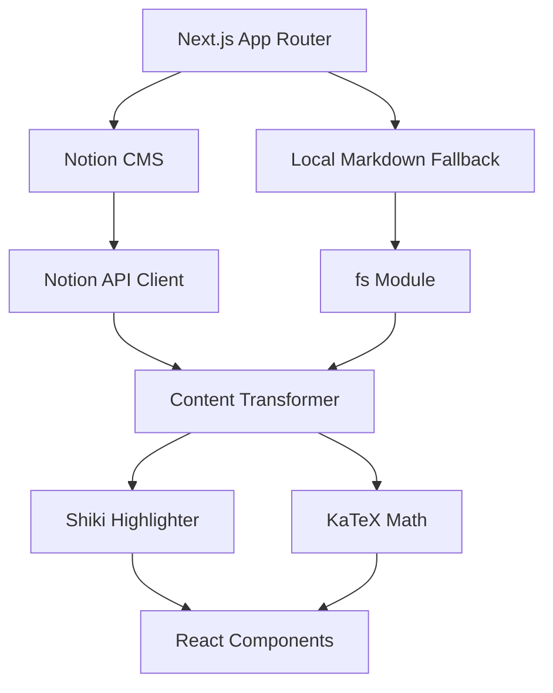

# Codebase Improvement Suggestions

## Executive Summary

This is a **Next.js 16 + TypeScript + Notion CMS** engineering blogfolio platform with sophisticated features including Shiki syntax highlighting, LaTeX math rendering, interactive quizzes, and GitHub-style alerts. The codebase demonstrates strong architectural decisions but has several areas for improvement in security, performance, code quality, and maintainability.

---

## 🔒 CRITICAL SECURITY ISSUES

### 1. **CRITICAL: API Endpoint Exposing Secrets** 
**File:** `/workspace/app/api/secrets/route.ts`

```typescript
export async function GET() {
  return NextResponse.json({
    telegram_token: process.env.TELEGRAM_TOKEN,
    telegram_chat_id: process.env.TELEGRAM_CHAT_ID,
  })
}
```

**Issue:** This endpoint exposes sensitive environment variables (Telegram bot token and chat ID) to ANYONE who calls it. This is a severe security vulnerability.

**Impact:** 
- Attackers can hijack your Telegram bot
- Send unauthorized messages through your bot
- Access private group chats
- Perform actions as your bot identity

**Recommendation:** 
```typescript
// OPTION 1: Delete this endpoint entirely if not needed
// OPTION 2: If needed for admin purposes, add authentication
import { NextRequest, NextResponse } from "next/server";
import { verifyAdminAuth } from "@/lib/auth"; // Implement this

export async function GET(request: NextRequest) {
  const isAuthenticated = await verifyAdminAuth(request);
  if (!isAuthenticated) {
    return NextResponse.json({ error: "Unauthorized" }, { status: 401 });
  }
  
  return NextResponse.json({
    telegram_token: process.env.TELEGRAM_TOKEN,
    telegram_chat_id: process.env.TELEGRAM_CHAT_ID,
  });
}
```

**Priority:** 🔴 **CRITICAL - Fix Immediately**

---

### 2. **HIGH: dangerouslySetInnerHTML Without Proper Sanitization**
**Files:** `/workspace/components/content-renderer.tsx`, `/workspace/components/author-bio-expander.tsx`

**Issue:** While DOMPurify is installed as a dependency, it's NOT being used to sanitize HTML content before rendering with `dangerouslySetInnerHTML`.

**Current Code:**
```tsx
<div
  dangerouslySetInnerHTML={{ __html: part }}
  style={{ display: "contents" }}
/>
```

**Recommendation:**
```tsx
import DOMPurify from 'dompurify';

// Sanitize before rendering
const sanitizedContent = DOMPurify.sanitize(part, {
  USE_PROFILES: { html: true },
  ADD_TAGS: ['iframe'], // If you need iframes for embeds
  ADD_ATTR: ['target', 'rel', 'data-quiz'], // Allow specific attributes
});

<div
  dangerouslySetInnerHTML={{ __html: sanitizedContent }}
  style={{ display: "contents" }}
/>
```

**Priority:** 🟠 **HIGH - Fix Soon**

---

### 3. **MEDIUM: Missing Rate Limiting on API Endpoints**
**Files:** All API routes (`/api/search`, `/api/author`, `/api/secrets`)

**Issue:** No rate limiting implemented, making the API vulnerable to:
- DDoS attacks
- Resource exhaustion
- Brute force attempts
- Scraping abuse

**Recommendation:** Implement rate limiting using `@vercel/kv` or a custom solution:

```typescript
import { Ratelimit } from "@upstash/ratelimit";
import { Redis } from "@upstash/redis";

const ratelimit = new Ratelimit({
  redis: Redis.fromEnv(),
  limiter: Ratelimit.slidingWindow(10, "10 s"), // 10 requests per 10 seconds
});

export async function GET(request: NextRequest) {
  const ip = request.ip ?? "127.0.0.1";
  const { success } = await ratelimit.limit(ip);
  
  if (!success) {
    return NextResponse.json({ error: "Too many requests" }, { status: 429 });
  }
  
  // ... rest of handler
}
```

**Priority:** 🟡 **MEDIUM**

---

### 4. **MEDIUM: Insecure External Link Handling**
**File:** `/workspace/components/content-renderer.tsx`

**Issue:** External links are processed client-side, which could be bypassed. The redirect through `/external-link` should validate URLs server-side.

**Recommendation:**
- Validate URLs server-side in the external-link route
- Maintain an allowlist/blocklist of domains
- Add `rel="noopener noreferrer"` consistently (already done ✓)

**Priority:** 🟡 **MEDIUM**

---

## ⚡ PERFORMANCE IMPROVEMENTS

### 1. **HIGH: Disable TypeScript Error Ignoring in Production**
**File:** `/workspace/next.config.mjs`

```typescript
const nextConfig = {
  typescript: {
    ignoreBuildErrors: true, // ❌ BAD: Hides type errors in production builds
  },
```

**Issue:** This allows production builds to succeed even with TypeScript errors, potentially shipping broken code.

**Recommendation:**
```typescript
const nextConfig = {
  typescript: {
    ignoreBuildErrors: false, // ✅ Good: Fail builds on type errors
    // OR remove this option entirely (defaults to false)
  },
  images: {
    unoptimized: true, // Consider if you really need this
    remotePatterns: [
      {
        protocol: "https",
        hostname: "**.notion.so", // Add Notion image domains
      },
      {
        protocol: "https",
        hostname: "placehold.co",
      },
    ],
  },
};
```

**Priority:** 🟠 **HIGH**

---

### 2. **MEDIUM: Optimize Shiki Highlighter Initialization**
**File:** `/workspace/lib/content.ts`

**Issue:** The highlighter is loaded asynchronously for each code block, which can cause performance issues during build time.

**Current Code:**
```typescript
async function getHighlighter() {
  if (!highlighter) {
    highlighter = await createHighlighter({
      themes: ["one-dark-pro"],
      langs: [/* 15 languages */],
    });
  }
  return highlighter;
}
```

**Recommendation:**
- Pre-load the highlighter at module initialization
- Use `getSingletonHighlighter()` from Shiki v0.14+
- Consider lazy-loading less common languages

```typescript
import { getSingletonHighlighter } from 'shiki';

// Initialize once at startup
const highlighterPromise = getSingletonHighlighter({
  themes: ["one-dark-pro"],
  langs: ["javascript", "typescript", "python", /* essential langs only */],
});
```

**Priority:** 🟡 **MEDIUM**

---

### 3. **MEDIUM: Image Optimization**
**File:** `/workspace/next.config.mjs`

```typescript
images: {
  unoptimized: true, // ❌ Disables Next.js image optimization
```

**Issue:** Disabling image optimization means:
- No automatic WebP/AVIF conversion
- No responsive image srcsets
- No lazy loading by default
- Larger payload sizes

**Recommendation:**
```typescript
images: {
  unoptimized: false, // Enable optimization
  remotePatterns: [
    {
      protocol: "https",
      hostname: "**.notion.so",
    },
    {
      protocol: "https",
      hostname: "**.githubusercontent.com",
    },
    {
      protocol: "https",
      hostname: "placehold.co",
    },
  ],
  formats: ['image/webp', 'image/avif'],
  deviceSizes: [640, 750, 828, 1080, 1200, 1920, 2048, 3840],
  imageSizes: [16, 32, 48, 64, 96, 128, 256, 384],
}
```

Then use `<Image />` component instead of `` tags throughout the codebase.

**Priority:** 🟡 **MEDIUM**

---

### 4. **LOW: Cache Strategy Improvements**
**File:** `/workspace/lib/content.ts`

**Current:** Uses `unstable_cache` with 1-hour revalidation for Notion content.

**Recommendation:**
- Implement incremental static regeneration (ISR) with shorter revalidation for frequently updated content
- Add cache invalidation hooks for manual purging
- Consider using Vercel KV or Redis for more granular cache control

```typescript
export const getContentByType = cache(async function (type: string) {
  if (isNotionEnabled) {
    const fetcher = unstable_cache(
      async () => fetchNotionContentByType(type),
      [`content-list-${type}`],
      { 
        revalidate: 300, // 5 minutes for better freshness
        tags: [`content-${type}`],
      },
    );
    return fetcher();
  }
  // ...
});
```

**Priority:** 🟢 **LOW**

---

## 📝 CODE QUALITY & BEST PRACTICES

### 1. **HIGH: Inconsistent Error Handling**
**Files:** Multiple files

**Issues:**
- Silent failures with empty array returns
- Console.error without proper logging strategy
- No error boundaries for React components

**Examples:**
```typescript
// /workspace/lib/notion.ts - Line 417
console.error(`Error fetching Notion content for ${type}:`, error);
return []; // ❌ Silently fails
```

**Recommendations:**

1. **Implement proper error logging:**
```typescript
import { logError } from '@/lib/logger';

try {
  // ... fetch logic
} catch (error) {
  logError('NotionFetchError', { type, error });
  throw error; // Or return a typed error result
}
```

2. **Add error boundaries:**
```tsx
// components/error-boundary.tsx
export class ErrorBoundary extends React.Component<Props, State> {
  componentDidCatch(error: Error, errorInfo: React.ErrorInfo) {
    logError('ComponentError', { error, errorInfo });
  }
  // ...
}
```

3. **Use Result types for better error handling:**
```typescript
type Result<T, E = Error> = 
  | { success: true; data: T }
  | { success: false; error: E };

async function getContentByType(type: string): Promise<Result<ContentItem[]>> {
  try {
    const items = await fetchNotionContentByType(type);
    return { success: true, data: items };
  } catch (error) {
    return { success: false, error: error as Error };
  }
}
```

**Priority:** 🟠 **HIGH**

---

### 2. **MEDIUM: Type Safety Improvements**
**Files:** Throughout codebase

**Issues:**
- Use of `any` types in critical locations
- Missing null checks
- Inconsistent type definitions

**Examples:**
```typescript
// /workspace/lib/notion.ts - Line 40
const { bookmark } = block as any; // ❌ Avoid 'any'

// /workspace/lib/content.ts - Line 354
const dataSourceId = (dbObj as any).data_sources?.[0]?.id || databaseId;
```

**Recommendations:**

1. **Define proper Notion types:**
```typescript
// types/notion.ts
interface NotionBlock {
  object: 'block';
  id: string;
  type: string;
  bookmark?: { url: string; caption?: RichTextItem[] };
  file?: {
    type: 'external' | 'file';
    name?: string;
    external?: { url: string };
    file?: { url: string };
  };
  // ... other block types
}

interface NotionPage {
  object: 'page';
  id: string;
  properties: Record<string, NotionProperty>;
}
```

2. **Use type guards:**
```typescript
function isBookmarkBlock(block: unknown): block is NotionBlock & { bookmark: {...} } {
  return (
    typeof block === 'object' &&
    block !== null &&
    'bookmark' in block &&
    typeof (block as any).bookmark === 'object'
  );
}
```

**Priority:** 🟡 **MEDIUM**

---

### 3. **MEDIUM: Magic Numbers and Strings**
**Files:** Multiple files

**Issues:**
- Hardcoded values without explanation
- Repeated string literals

**Examples:**
```typescript
// /workspace/lib/content.ts - Line 313
const wordsPerMinute = 200; // ❌ Magic number

// /workspace/lib/content.ts - Line 429
{ revalidate: 3600, tags: [`content-${type}`] }, // ❌ Magic number
```

**Recommendations:**
```typescript
// lib/constants.ts
export const READING_SPEED = {
  WORDS_PER_MINUTE: 200,
  TECHNICAL_WORDS_PER_MINUTE: 150,
};

export const CACHE = {
  NOTION_REVALIDATION_SECONDS: 300, // 5 minutes
  AUTHOR_CACHE_SECONDS: 3600, // 1 hour
};

export const ALERT_TYPES = {
  NOTE: { color: 'blue', icon: 'info' } as const,
  TIP: { color: 'green', icon: 'lightbulb' } as const,
  IMPORTANT: { color: 'purple', icon: 'alert-circle' } as const,
  WARNING: { color: 'yellow', icon: 'alert-triangle' } as const,
  CAUTION: { color: 'red', icon: 'alert-octagon' } as const,
};
```

**Priority:** 🟡 **MEDIUM**

---

### 4. **LOW: Code Duplication**
**Files:** `/workspace/lib/content.ts`

**Issue:** Author fetching logic is duplicated across multiple functions (`getAuthorBasic`, `getAuthorBySlug`, `getAllAuthors`).

**Recommendation:** Extract common logic into reusable utilities:

```typescript
// lib/author-utils.ts
async function fetchAuthorFromNotion(slug?: string) {
  const databaseId = DATABASE_IDS.authors;
  if (!databaseId) return null;
  
  const dbObj = await notion.databases.retrieve({ database_id: databaseId });
  const dataSourceId = (dbObj as DatabaseObject).data_sources?.[0]?.id || databaseId;
  
  const filter = slug ? {
    property: 'Slug',
    rich_text: { equals: slug },
  } : {
    property: 'Status',
    select: { equals: 'Published' },
  };
  
  const response = await notion.dataSources.query({
    data_source_id: dataSourceId,
    filter,
  });
  
  return response.results;
}

function mapNotionPageToAuthor(page: NotionPage): Author {
  const props = page.properties;
  return {
    name: getPlainText(props.Name || props.Title),
    slug: getPlainText(props.Slug),
    role: getPlainText(props.Role),
    bio: getPlainText(props.Biography),
    avatar: getImageUrl(props.avatar || props.Avatar) || '',
    twitter: getPlainText(props.twitter || props.Twitter),
    github: getPlainText(props.GitHub || props.github),
    linkedin: getPlainText(props.linkedin || props.LinkedIn || props.Linkedin),
  };
}
```

**Priority:** 🟢 **LOW**

---

## 🏗️ ARCHITECTURE IMPROVEMENTS

### 1. **HIGH: Monolithic content.ts File**
**File:** `/workspace/lib/content.ts` (867 lines)

**Issue:** This file is doing too much:
- Notion API integration
- Markdown parsing
- Syntax highlighting
- Content transformation
- Author management
- Caching logic

**Recommendation:** Split into focused modules:

```
lib/
├── content/
│   ├── index.ts              # Exports and orchestration
│   ├── notion-client.ts      # Notion API client setup
│   ├── notion-transformers.ts # Custom Notion block transformers
│   ├── markdown-parser.ts    # Markdown processing with marked
│   ├── syntax-highlight.ts   # Shiki integration
│   ├── content-transforms.ts # Alert, quiz, heading injections
│   └── validators.ts         # Content validation utilities
├── authors/
│   ├── index.ts
│   ├── author-service.ts     # Author CRUD operations
│   └── author-types.ts       # Author type definitions
├── cache/
│   ├── index.ts
│   ├── cache-strategies.ts   # Cache configuration
│   └── cache-keys.ts         # Cache key generation
└── constants.ts              # App-wide constants
```

**Priority:** 🟠 **HIGH**

---

### 2. **MEDIUM: Missing Configuration Management**
**Issue:** Configuration is scattered across:
- Environment variables
- Hardcoded values
- Multiple config files

**Recommendation:** Create a centralized configuration system:

```typescript
// lib/config/index.ts
import { z } from 'zod';

const configSchema = z.object({
  notion: z.object({
    authToken: z.string().min(1),
    blogId: z.string().uuid(),
    articlesId: z.string().uuid(),
    // ...
  }),
  site: z.object({
    url: z.string().url(),
    title: z.string(),
    description: z.string(),
  }),
  features: z.object({
    enableQuiz: z.boolean().default(true),
    enableSearch: z.boolean().default(true),
    enableBookmarks: z.boolean().default(true),
  }),
});

type Config = z.infer<typeof configSchema>;

function loadConfig(): Config {
  const result = configSchema.safeParse({
    notion: {
      authToken: process.env.NOTION_AUTH_TOKEN,
      blogId: process.env.NOTION_BLOG_ID,
      // ...
    },
    site: {
      url: process.env.SITE_URL,
      title: 'Engineering Workspace',
      description: '...',
    },
    features: {
      enableQuiz: true,
      enableSearch: true,
      enableBookmarks: true,
    },
  });
  
  if (!result.success) {
    console.error('Invalid configuration:', result.error);
    throw new Error('Configuration validation failed');
  }
  
  return result.data;
}

export const config = loadConfig();
```

**Benefits:**
- Type-safe configuration
- Validation at startup
- Single source of truth
- Easy testing with mock configs

**Priority:** 🟡 **MEDIUM**

---

### 3. **MEDIUM: Missing Logging Strategy**
**Issue:** Scattered `console.error` and `console.log` calls without structure.

**Recommendation:** Implement structured logging:

```typescript
// lib/logger.ts
type LogLevel = 'debug' | 'info' | 'warn' | 'error';

interface LogEntry {
  timestamp: string;
  level: LogLevel;
  message: string;
  context?: Record<string, unknown>;
  error?: Error;
}

class Logger {
  private level: LogLevel = process.env.LOG_LEVEL || 'info';
  
  private log(level: LogLevel, message: string, context?: Record<string, unknown>) {
    if (this.shouldLog(level)) {
      const entry: LogEntry = {
        timestamp: new Date().toISOString(),
        level,
        message,
        context,
      };
      
      // Structured JSON logging in production
      if (process.env.NODE_ENV === 'production') {
        console[level](JSON.stringify(entry));
      } else {
        console[level](`[${level.toUpperCase()}] ${message}`, context || '');
      }
      
      // Send to external logging service (e.g., Sentry, Logtail)
      if (level === 'error' && process.env.SENTRY_DSN) {
        // captureException(...)
      }
    }
  }
  
  error(message: string, error?: Error, context?: Record<string, unknown>) {
    this.log('error', message, { ...context, error: error?.stack });
  }
  
  warn(message: string, context?: Record<string, unknown>) {
    this.log('warn', message, context);
  }
  
  info(message: string, context?: Record<string, unknown>) {
    this.log('info', message, context);
  }
  
  debug(message: string, context?: Record<string, unknown>) {
    this.log('debug', message, context);
  }
  
  private shouldLog(level: LogLevel): boolean {
    const levels: LogLevel[] = ['debug', 'info', 'warn', 'error'];
    return levels.indexOf(level) >= levels.indexOf(this.level);
  }
}

export const logger = new Logger();
```

**Priority:** 🟡 **MEDIUM**

---

## 📚 DOCUMENTATION IMPROVEMENTS

### 1. **HIGH: Missing API Documentation**
**Issue:** No documentation for:
- API endpoints (`/api/search`, `/api/author`, `/api/secrets`)
- Component props and usage
- Custom hook interfaces

**Recommendation:**

1. **Add OpenAPI/Swagger documentation:**
```bash
pnpm add -D @asteasolutions/zod-to-openapi swagger-ui-react
```

2. **Document API routes:**
```typescript
// app/api/search/route.ts
/**
 * GET /api/search
 * 
 * Retrieves all searchable content from the CMS.
 * 
 * @returns {SearchResult[]} Array of searchable items
 * 
 * @example
 * ```ts
 * const response = await fetch('/api/search');
 * const results: SearchResult[] = await response.json();
 * ```
 */
export async function GET() {
  // ...
}
```

3. **Add JSDoc to components:**
```tsx
/**
 * ContentRenderer - Renders rich text content with enhanced features
 * 
 * Features:
 * - KaTeX math rendering
 * - Interactive quizzes
 * - Syntax highlighted code blocks
 * - Auto-linked external URLs
 * 
 * @param content - HTML content string to render
 * @param id - Optional content ID for quiz navigation
 * 
 * @example
 * ```tsx
 * <ContentRenderer content={post.content} id={post.slug} />
 * ```
 */
export function ContentRenderer({ content, id }: ContentRendererProps) {
  // ...
}
```

**Priority:** 🟠 **HIGH**

---

### 2. **MEDIUM: Improve README.md**
**Current:** Good overview but missing:
- Architecture diagram
- Development workflow
- Testing instructions
- Deployment guide
- Troubleshooting section

**Recommendations:**

Add sections for:
```markdown
## Architecture



## Development

### Prerequisites
- Node.js 20+
- pnpm 8+
- Notion account (optional)

### Setup
[Detailed steps...]

### Running Tests
[Add when tests are implemented]

## Deployment

### Vercel (Recommended)
[Steps...]

### Docker
[Steps...]

## Troubleshooting

### Common Issues
- Notion connection errors
- Build failures
- Performance issues
```

**Priority:** 🟡 **MEDIUM**

---

### 3. **LOW: Missing CHANGELOG**
**Issue:**虽然有 `.github/workflows/generate-changelog.yml` but no actual CHANGELOG.md file.

**Recommendation:**
- Create `CHANGELOG.md` following Keep a Changelog format
- Automate changelog generation from Git commits
- Document breaking changes clearly

```markdown
# Changelog

All notable changes to this project will be documented in this file.

The format is based on [Keep a Changelog](https://keepachangelog.com/en/1.0.0/),
and this project adheres to [Semantic Versioning](https://semver.org/spec/v2.0.0.html).

## [Unreleased]

### Security
- **FIXED**: Removed exposed secrets endpoint (/api/secrets)

### Added
- Rate limiting on API endpoints
- Structured logging system

### Changed
- Refactored content.ts into modular architecture

## [1.0.0] - 2024-XX-XX

### Added
- Initial release
```

**Priority:** 🟢 **LOW**

---

## 🧪 TESTING RECOMMENDATIONS

### 1. **HIGH: No Test Coverage**
**Issue:** No test files found in the codebase.

**Recommendation:** Implement comprehensive testing strategy:

```bash
pnpm add -D vitest @testing-library/react @testing-library/jest-dom jsdom
```

**Test Structure:**
```
__tests__/
├── unit/
│   ├── content-transforms.test.ts
│   ├── notion-helpers.test.ts
│   └── utils.test.ts
├── integration/
│   ├── api-search.test.ts
│   ├── api-author.test.ts
│   └── notion-integration.test.ts
└── e2e/
    ├── homepage.spec.ts
    ├── article-navigation.spec.ts
    └── search-functionality.spec.ts
```

**Example Unit Test:**
```typescript
// __tests__/unit/content-transforms.test.ts
import { describe, it, expect } from 'vitest';
import { injectAlerts } from '@/lib/content-transforms';

describe('injectAlerts', () => {
  it('should transform GitHub-style alerts to styled divs', () => {
    const input = `
      <blockquote>
        <p>[!NOTE]</p>
        This is important information.
      </blockquote>
    `;
    
    const result = injectAlerts(input);
    
    expect(result).toContain('border-l-4');
    expect(result).toContain('border-blue-500');
    expect(result).toContain('NOTE');
  });
  
  it('should handle all alert types', () => {
    const alertTypes = ['NOTE', 'TIP', 'IMPORTANT', 'WARNING', 'CAUTION'];
    
    alertTypes.forEach(type => {
      const input = `<blockquote><p>[!${type}]</p></blockquote>`;
      const result = injectAlerts(input);
      expect(result).toContain(type);
    });
  });
});
```

**Priority:** 🟠 **HIGH**

---

## 🔧 BUILD & CI/CD IMPROVEMENTS

### 1. **MEDIUM: Enhance ESLint Configuration**
**File:** `/workspace/eslint.config.mjs`

**Current:** Basic configuration using compat layer.

**Recommendation:** Upgrade to flat config with stricter rules:

```javascript
// eslint.config.mjs
import eslint from '@eslint/js';
import tseslint from 'typescript-eslint';
import reactPlugin from 'eslint-plugin-react';
import reactHooksPlugin from 'eslint-plugin-react-hooks';
import securityPlugin from 'eslint-plugin-security';

export default tseslint.config(
  eslint.configs.recommended,
  ...tseslint.configs.strictTypeChecked,
  ...tseslint.configs.stylisticTypeChecked,
  {
    languageOptions: {
      parserOptions: {
        projectService: true,
        tsconfigRootDir: import.meta.dirname,
      },
    },
  },
  {
    plugins: {
      react: reactPlugin,
      'react-hooks': reactHooksPlugin,
      security: securityPlugin,
    },
    rules: {
      'react-hooks/rules-of-hooks': 'error',
      'react-hooks/exhaustive-deps': 'warn',
      'security/detect-object-injection': 'warn',
      'security/detect-non-literal-fs-filename': 'warn',
      '@typescript-eslint/no-explicit-any': 'error',
      '@typescript-eslint/no-unused-vars': ['warn', { argsIgnorePattern: '^_' }],
      'no-console': ['warn', { allow: ['warn', 'error'] }],
    },
  },
  {
    ignores: [
      'node_modules/**',
      '.next/**',
      'out/**',
      '*.config.*',
    ],
  },
);
```

**Install additional plugins:**
```bash
pnpm add -D typescript-eslint eslint-plugin-react eslint-plugin-react-hooks eslint-plugin-security
```

**Priority:** 🟡 **MEDIUM**

---

### 2. **MEDIUM: Add Pre-commit Hooks**
**Issue:** No git hooks to enforce code quality before commits.

**Recommendation:** Install Husky + lint-staged:

```bash
pnpm add -D husky lint-staged
npx husky init
```

**.husky/pre-commit:**
```bash
#!/usr/bin/env sh
. "$(dirname -- "$0")/_/husky.sh"

npx lint-staged
```

**package.json:**
```json
{
  "lint-staged": {
    "*.{ts,tsx}": [
      "eslint --fix",
      "tsc --noEmit"
    ],
    "*.{js,jsx,json,md}": [
      "prettier --write"
    ]
  }
}
```

**Priority:** 🟡 **MEDIUM**

---

### 3. **LOW: Add GitHub Actions Workflows**
**Current:** Only has `generate-changelog.yml`.

**Recommendation:** Add CI workflows:

**.github/workflows/ci.yml:**
```yaml
name: CI

on:
  push:
    branches: [main]
  pull_request:
    branches: [main]

jobs:
  lint:
    runs-on: ubuntu-latest
    steps:
      - uses: actions/checkout@v4
      - uses: pnpm/action-setup@v2
        with:
          version: 8
      - uses: actions/setup-node@v4
        with:
          node-version: 20
          cache: 'pnpm'
      
      - run: pnpm install
      - run: pnpm lint
      
  type-check:
    runs-on: ubuntu-latest
    steps:
      - uses: actions/checkout@v4
      - uses: pnpm/action-setup@v2
      - uses: actions/setup-node@v4
        with:
          node-version: 20
          cache: 'pnpm'
      
      - run: pnpm install
      - run: tsc --noEmit
      
  test:
    runs-on: ubuntu-latest
    steps:
      - uses: actions/checkout@v4
      - uses: pnpm/action-setup@v2
      - uses: actions/setup-node@v4
        with:
          node-version: 20
          cache: 'pnpm'
      
      - run: pnpm install
      - run: pnpm test
      
  build:
    runs-on: ubuntu-latest
    needs: [lint, type-check, test]
    steps:
      - uses: actions/checkout@v4
      - uses: pnpm/action-setup@v2
      - uses: actions/setup-node@v4
        with:
          node-version: 20
          cache: 'pnpm'
      
      - run: pnpm install
      - run: pnpm build
```

**Priority:** 🟢 **LOW**

---

## 🎨 ACCESSIBILITY IMPROVEMENTS

### 1. **MEDIUM: Verify Accessibility Compliance**
**File:** `/workspace/app/accessibility/` exists but needs verification

**Recommendations:**

1. **Add automated accessibility testing:**
```bash
pnpm add -D axe-core @axe-core/react
```

2. **Ensure all interactive elements are keyboard accessible:**
- Check custom buttons (copy buttons, etc.)
- Verify focus management in modals
- Test screen reader compatibility

3. **Add skip links:**
```tsx
// app/layout.tsx
<a href="#main-content" className="sr-only focus:not-sr-only focus:absolute focus:top-4 focus:left-4 bg-primary text-primary-foreground px-4 py-2 rounded">
  Skip to main content
</a>
```

4. **Verify color contrast:**
- Use tools like Stark or Color Contrast Analyzer
- Ensure WCAG AA compliance (4.5:1 for normal text)

**Priority:** 🟡 **MEDIUM**

---

## 📊 MONITORING & ANALYTICS

### 1. **LOW: Add Performance Monitoring**
**Current:** Has `@vercel/speed-insights` but limited monitoring.

**Recommendations:**

1. **Add comprehensive error tracking:**
```bash
pnpm add @sentry/nextjs
```

2. **Implement Core Web Vitals tracking:**
```typescript
// app/layout.tsx
import { ReportWebVitals } from 'next/web-vitals';

export function reportWebVitals(metric: NextWebVitalsMetric) {
  // Send to analytics endpoint
  fetch('/api/analytics', {
    method: 'POST',
    body: JSON.stringify(metric),
  });
}
```

3. **Add uptime monitoring:**
- Use UptimeRobot or similar service
- Set up alerts for downtime

**Priority:** 🟢 **LOW**

---

## 📋 SUMMARY & PRIORITIZATION

### Immediate Actions (This Week) 🔴
1. **Remove or secure `/api/secrets` endpoint** - CRITICAL SECURITY
2. **Implement DOMPurify sanitization** - HIGH SECURITY
3. **Disable `ignoreBuildErrors`** - HIGH QUALITY

### Short-term (This Month) 🟠
4. **Add rate limiting to API endpoints**
5. **Refactor monolithic content.ts file**
6. **Implement error boundaries and proper error handling**
7. **Add comprehensive test suite**
8. **Improve API documentation**

### Medium-term (Next Quarter) 🟡
9. **Enable image optimization**
10. **Implement centralized configuration with Zod**
11. **Add structured logging**
12. **Upgrade ESLint configuration**
13. **Add pre-commit hooks**
14. **Improve type safety (remove `any` types)**
15. **Verify accessibility compliance**

### Long-term 🟢
16. **Add CI/CD workflows**
17. **Create CHANGELOG automation**
18. **Implement performance monitoring**
19. **Add caching improvements**
20. **Reduce code duplication**

---

## 🎯 CONCLUSION

This is a well-architected, feature-rich platform with excellent foundations. The primary concerns are:

1. **Security vulnerabilities** that need immediate attention
2. **Code organization** that will become unmanageable as the project grows
3. **Lack of testing** which increases risk of regressions
4. **Documentation gaps** that hinder onboarding and maintenance

Addressing these issues will significantly improve the platform's reliability, maintainability, and security posture.

---

*Generated: $(date)*
*Reviewer: AI Code Quality Assistant*
