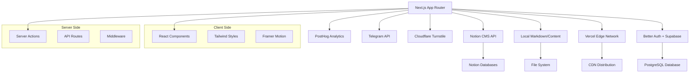

# Next Notion CMS


### A modern, high-performance technical documentation and engineering portfolio platform built with **Next.js 16**, **Tailwind CSS 4**, and **TypeScript**. Optimized for mechatronics research, digital architecture, and high-fidelity documentation.

---

## 🏆 Badges


---

## 🎯 Quick Actions

[](https://next-notion-cms.vercel.app)
[](https://github.com/prasad-kmd/next-notion-cms/issues/new?template=bug_report.md)
[](https://github.com/prasad-kmd/next-notion-cms/issues/new?template=feature_request.md)

---

## 📖 Description

**Next Notion CMS** is a cutting-edge content management system that transforms Notion into a powerful headless CMS for technical documentation, engineering portfolios, and research publications. Built on the latest Next.js 16 with App Router, it delivers exceptional performance through server-side rendering, optimized image delivery, and intelligent caching strategies.

The platform features a comprehensive authentication system powered by Better Auth with Supabase PostgreSQL, multi-provider OAuth support, and a custom analytics dashboard with PostHog integration. Its unique design identity includes specialized content cards for blogs, articles, and projects, along with a technical wiki for persistent knowledge management.

Perfect for researchers, engineers, and developers who need a robust, scalable, and visually stunning documentation platform that integrates seamlessly with their existing Notion workflows.

---

## ✨ Features

### 📝 Content Management
- **📔 Notion CMS Integration** - Fully integrated with Notion as a headless CMS for blog, articles, projects, tutorials, and wiki
- **💬 Native Notion Comments** - Built-in commenting system using Notion's Comments API with authentication gates and Cloudflare Turnstile protection
- **✍️ Authors System** - Comprehensive contributor directory with high-fidelity "Dossier" profile pages and contribution metrics
- **📊 Dynamic Sitemap** - Recursively generated sitemap including all content types and authors

### 🎨 User Experience
- **♿ Custom Accessibility Controller** - Scoped text adjustments (size, font, spacing, contrast) with draggable interface and persistence
- **🎯 Smart TOC** - Automatically generated Table of Contents with active-state scroll tracking
- **🔍 Search & Command Palette** - Global `Cmd+K` search modal for quick navigation
- **🎨 Unique Design Identity** - Redesigned Hero with technical "Engineering Excellence" dashboard, specialized cards for different content types

### 📈 Analytics & Monitoring
- **📊 Advanced Analytics** - Integrated PostHog for real-time user insights with custom Admin Analytics Dashboard
- **👁️ View Tracking** - Per-page view counts with aggregated tracking and performance-optimized caching
- **📊 Modern Visualizations** - Recharts-based visualizations (Tremor style) for high-fidelity data experience
- **🩺 System Health Monitoring** - Real-time health checks for Notion, Supabase, and PostHog with historical Logging Engine (7-day retention)

### 🔐 Auth & Security
- **🔐 Robust Authentication** - Better Auth with Supabase (PostgreSQL) using Drizzle ORM
- **🌐 Multi-Provider OAuth** - Google, GitHub, Facebook, Twitter, Reddit, Notion, Vercel with automatic account linking
- **🛡️ Stateless JWT Sessions** - Free-tier optimization with secure session management
- **👤 User Dashboard** - Comprehensive profile management and account connectivity
- **🛡️ Spam Protection** - Temp-mail domain blocker and rate limiting on contact form submissions

### ⚡ Performance & SEO
- **🚀 Performance-First Architecture** - Next.js 16 (App Router) for lightning-fast SSR and minimal client-side hydration
- **🖼️ Image Excellence** - Next.js optimized images with LQIP, blur-up effects, and native lazy loading
- **🔍 Semantic SEO** - Full Schema.org (JSON-LD) integration for articles, blog posts, and breadcrumbs
- **⚡ Premium Shiki Highlighting** - VS Code-accurate syntax highlighting with lazy-loaded languages
- **📐 LaTeX Support** - Full math notation rendering via KaTeX (Inline: $F=ma$, Block: $$E=mc^2$$)
- **🎯 Interactive Quizzes** - Dynamic, base64-encoded quiz components injectable directly into content
- **🚨 GitHub-style Alerts** - Support for `[!NOTE]`, `[!TIP]`, `[!WARNING]`, etc.

---

## 📸 Screenshots / Gallery

### Hero & Landing

*Engineering Excellence Dashboard with timed carousel of latest works*


*Technical features showcase with code-focused aesthetics*


*Specialized content cards for blogs, articles, and projects*


*High-fidelity documentation layout with syntax highlighting*

### Page Previews

*Blog listing with specialized card design*


*Personal diary section with clean typography*


*Ideas and concepts visualization*


*Technical workflow illustrations*

### About & Contact

*Team and contributors showcase*


*Secure contact form with Telegram integration*

---

## 🚀 Quick Start

Get up and running in minutes:

```bash
# 1. Clone the repository
git clone https://github.com/prasad-kmd/next-notion-cms.git
cd next-notion-cms

# 2. Install dependencies (pnpm recommended)
pnpm install

# 3. Copy environment variables
cp .env.local.example .env.local

# 4. Create required directories
mkdir -p public/data

# 5. Start development server
pnpm dev
```

Visit `http://localhost:3000` to see your local instance!

---

## 📋 Setup Guide

### Notion Configuration

1. **Create Integration**: Visit [Notion - My Integrations](https://www.notion.so/my-integrations) and create a new integration
2. **Create Databases**: Set up databases for **Blog**, **Articles**, **Tutorials**, **Projects**, **Wiki**, and **Authors**
3. **Share Databases**: Share each database with your newly created integration
4. **Copy IDs**: Extract Database IDs from the URL and copy your Internal Integration Token

For detailed schema and setup steps, refer to the Notion configuration guide.

### Environment Variables

| Variable | Description | Required | Example |
|----------|-------------|----------|---------|
| `NOTION_AUTH_TOKEN` | Notion integration token | ✅ | `secret_xxx...` |
| `NOTION_BLOG_ID` | Blog database ID | ✅ | `abc123...` |
| `NOTION_ARTICLES_ID` | Articles database ID | ✅ | `def456...` |
| `NOTION_PROJECTS_ID` | Projects database ID | ✅ | `ghi789...` |
| `NOTION_TUTORIALS_ID` | Tutorials database ID | ✅ | `jkl012...` |
| `NOTION_WIKI_ID` | Wiki database ID | ✅ | `mno345...` |
| `NOTION_AUTHORS_ID` | Authors database ID | ✅ | `pqr678...` |
| `DATABASE_URL` | PostgreSQL connection string | ✅ | `postgresql://...` |
| `BETTER_AUTH_SECRET` | 32-char auth secret | ✅ | Random 32-char string |
| `BETTER_AUTH_URL` | Auth callback URL | ✅ | `http://localhost:3000` |
| `NEXT_PUBLIC_TURNSTILE_SITE_KEY` | Cloudflare Turnstile site key | ✅ | `1x00000000000000000000AA` |
| `TURNSTILE_SECRET_KEY` | Cloudflare Turnstile secret | ✅ | `1x0000000000000000000000000000000AA` |
| `GOOGLE_CLIENT_ID` | Google OAuth client ID | ❌ | From Google Cloud Console |
| `GOOGLE_CLIENT_SECRET` | Google OAuth secret | ❌ | From Google Cloud Console |
| `GITHUB_CLIENT_ID` | GitHub OAuth client ID | ❌ | From GitHub Developer Settings |
| `GITHUB_CLIENT_SECRET` | GitHub OAuth secret | ❌ | From GitHub Developer Settings |
| `TELEGRAM_TOKEN` | Telegram bot token | ❌ | For contact form |
| `TELEGRAM_CHAT_ID` | Telegram chat ID | ❌ | For contact form notifications |
| `POSTHOG_PERSONAL_API_KEY` | PostHog API key | ❌ | For analytics |
| `POSTHOG_PROJECT_ID` | PostHog project ID | ❌ | For analytics |
| `NEXT_PUBLIC_POSTHOG_KEY` | PostHog public key | ❌ | For client-side analytics |

### Database & Auth Setup

1. **Supabase Setup**:
   - Create a new project at [Supabase](https://supabase.com)
   - Copy the connection string to `DATABASE_URL`
   - Run migrations: `pnpm db:push`

2. **Better Auth Configuration**:
   - Generate a secure secret:
     ```powershell
     [Convert]::ToBase64String([System.Security.Cryptography.RandomNumberGenerator]::GetBytes(32))
     ```
   - Configure OAuth providers in your `.env.local`

3. **Cloudflare Turnstile**:
   - Get your keys at [Cloudflare Dashboard](https://developers.cloudflare.com/turnstile/get-started/)
   - For local development, use test keys provided in the table above

---

## 🛠️ Tech Stack

| Category | Technology | Purpose |
|----------|------------|---------|
| **Framework** | Next.js 16 (App Router) | React framework with SSR/SSG |
| **Language** | TypeScript 5 | Type-safe JavaScript |
| **Styling** | Tailwind CSS 4 | Utility-first CSS framework |
| **Authentication** | Better Auth | Next-gen authentication |
| **Database** | Supabase (PostgreSQL) | Managed PostgreSQL database |
| **ORM** | Drizzle ORM | Type-safe database ORM |
| **CMS** | Notion API | Headless CMS backend |
| **Charts** | Recharts | Data visualization (Tremor style) |
| **Syntax Highlighting** | Shiki | VS Code-accurate code highlighting |
| **Animations** | Framer Motion + GSAP | Smooth UI animations |
| **Validation** | Zod | TypeScript-first schema validation |
| **Analytics** | PostHog | Product analytics platform |
| **Security** | Cloudflare Turnstile | CAPTCHA alternative |
| **Package Manager** | pnpm 9 | Fast, disk-efficient package manager |

---

## 🏗️ Architecture



For detailed architecture documentation, see [design.md](design.md).

---

## 📁 Project Structure

```text
next-notion-cms/
├── app/                    # Next.js App Router
│   ├── (auth)/            # Authentication routes
│   ├── (main)/            # Main content routes
│   ├── api/               # API endpoints
│   ├── dashboard/         # User dashboard
│   └── admin/             # Admin panel
├── components/            # Reusable UI components
│   ├── ui/                # Base UI components
│   ├── content/           # Content-related components
│   ├── analytics/         # Analytics components
│   └── auth/              # Authentication components
├── content/               # Fallback Markdown/HTML files
├── contexts/              # React contexts
├── hooks/                 # Custom React hooks
├── lib/                   # Utility libraries
│   ├── content/           # Content processing
│   ├── auth/              # Authentication utilities
│   ├── db/                # Database utilities
│   └── config.ts          # Site configuration
├── providers/             # Context providers
├── public/                # Static assets
│   ├── img/               # Images and badges
│   ├── fonts/             # Custom fonts
│   └── data/              # Dynamic data files
├── styles/                # Global styles
├── types/                 # TypeScript definitions
├── .github/               # GitHub configurations
├── drizzle/               # Database migrations
├── .env.local.example     # Environment template
├── drizzle.config.ts      # Drizzle ORM config
├── next.config.mjs        # Next.js configuration
├── tailwind.config.js     # Tailwind configuration
├── tsconfig.json          # TypeScript configuration
└── package.json           # Dependencies and scripts
```

---

## 🚀 Deployment

### Vercel (Recommended)

The easiest way to deploy your application:

1. Push your code to GitHub
2. Import your repository at [Vercel](https://vercel.com/new)
3. Configure environment variables in Vercel dashboard
4. Deploy!

Vercel automatically handles:
- Edge network distribution
- Automatic HTTPS
- Preview deployments for pull requests
- Zero-config CI/CD pipeline

### Docker Deployment

For self-hosting or alternative deployment targets:

```dockerfile
# Build stage
FROM node:20-alpine AS builder
WORKDIR /app
COPY package.json pnpm-lock.yaml ./
RUN npm install -g pnpm && pnpm install --frozen-lockfile
COPY . .
RUN pnpm build

# Production stage
FROM node:20-alpine AS runner
WORKDIR /app
COPY --from=builder /app/package.json ./
COPY --from=builder /app/node_modules ./node_modules
COPY --from=builder /app/.next ./.next
COPY --from=builder /app/public ./public

EXPOSE 3000
CMD ["pnpm", "start"]
```

Build and run:
```bash
docker build -t next-notion-cms .
docker run -p 3000:3000 --env-file .env.local next-notion-cms
```

---

## 🤝 Contributing

We welcome contributions! Please read our guidelines before submitting:

- [Contributing Guidelines](CONTRIBUTING.md) - How to contribute
- [Code of Conduct](CODE_OF_CONDUCT.md) - Community standards
- [Security Policy](SECURITY.md) - Reporting vulnerabilities
- [Design Documentation](design.md) - Architecture and design decisions
- [Rules](rules.md) - Development rules and conventions

---

## 🔒 Security

This project takes security seriously. Key security measures include:

- **Server-side only** processing of sensitive API keys
- **Zod-validated** environment variables and form inputs
- **Content Security Policy (CSP)** and security headers enabled
- **Rate limiting** on contact form submissions
- **Cloudflare Turnstile** CAPTCHA protection for comments

For reporting security vulnerabilities, please see [SECURITY.md](SECURITY.md).

---

## 📄 License

This project is licensed under the [AGPL-3.0 License](LICENSE).

---

## 👨‍💻 Author

**Prasad M.** - [@prasad-kmd](https://github.com/prasad-kmd)

[](https://github.com/prasad-kmd)
[](https://twitter.com/prasadmadhuran1)
[](https://linkedin.com/in/prasad-madhuranga)

---

## ⭐ Support the Project

If you find this project useful, please consider giving it a star!

[](https://github.com/prasad-kmd/next-notion-cms)

---

## 📊 Contributors

<a href="https://github.com/prasad-kmd/next-notion-cms/graphs/contributors">
  
</a>

## 📈 Contributor Stats


## ⭐ Star History


---

<p align="center">Built with ❤️ by <strong>Prasad M.</strong></p>