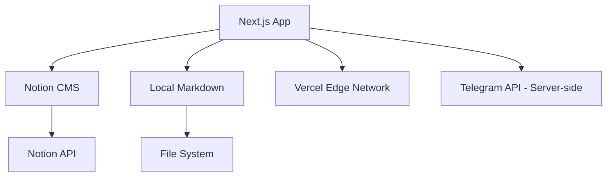

# Next Notion CMS  

A modern, high-performance technical documentation and engineering portfolio platform built with **Next.js 16**, **Tailwind CSS 4**, and **TypeScript**. Optimized for mechatronics research, digital architecture, and high-fidelity documentation.

---
<!--  -->


<!--  -->
<!--  -->
<!--  -->
<!--  -->
<!--  -->
<!--  -->
<!--  -->
<!--  -->
<!--  -->
<!--  -->
<!--  -->
<!--  -->


---

## ✨ Features

- **🚀 Performance-First Architecture:** Built with **Next.js 16** (App Router) for lightning-fast server-side rendering and minimal client-side hydration.
- **📊 Advanced Analytics & View Tracking:** Integrated **PostHog** for real-time user insights and a custom **Admin Analytics Dashboard**. Features per-page view counts for all content with aggregated tracking and performance-optimized caching. **Modern Recharts-based visualizations** (Tremor style) for a high-fidelity data experience.
- **🔐 Robust Authentication & Dashboard:** Integrated **Better Auth** with **Supabase** (PostgreSQL) using **Drizzle ORM**. Supports multi-provider OAuth (Google, GitHub, Facebook, Twitter, Reddit, Notion, Vercel) with automatic account linking and stateless JWT sessions for free-tier optimization. Includes a comprehensive **User Dashboard** for profile management and account connectivity.
- **♿ Custom Accessibility Controller:** Scoped text adjustments (size, font, spacing, contrast) specifically for content areas to ensure optimal readability. Features a draggable interface and persistence.
- **📔 Notion CMS Integration:** Fully integrated with Notion as a headless CMS. Manage your blog, articles, projects, tutorials, and wiki directly from Notion.
- **💬 Native Notion Comments:** Built-in commenting system using Notion's native Comments API. Features authentication gates (Better Auth), user attribution, infinite scrolling, rate limiting, and **Cloudflare Turnstile CAPTCHA** protection.
- **🎨 Unique Design Identity:** 
  - **Redesigned Hero (v7):** A technical "Engineering Excellence" dashboard with a timed carousel of latest works, code-focused aesthetics, and geometric grid systems.
  - **Specialized Cards:** Distinct visual identities for **Blog**, **Articles**, and **Projects** to distinguish different content types.
  - **Technical Wiki:** A structured digital garden for persistent knowledge and documentation.
- **✍️ Authors System:** A comprehensive directory of contributors with high-fidelity "Dossier" profile pages, contribution metrics, and social integration.
- **🛠️ Advanced Technical Pipeline:**
  - **Premium Shiki Highlighting:** VS Code-accurate syntax highlighting using Shiki themes (One Dark Pro) with a custom Mac-style window UI. Lazy-loaded languages for better performance.
  - **LaTeX Support:** Full math notation rendering via KaTeX (Inline math: $F=ma$ and Block math: $$E=mc^2$$).
  - **Interactive Quizzes:** Dynamic, base64-encoded quiz components injectable directly into content.
  - **GitHub-style Alerts:** Support for `[!NOTE]`, `[!TIP]`, `[!WARNING]`, etc.
- **🛡️ Enterprise-Grade Utilities:**
  - **Smart Preferences Sync:** Automatically syncs local bookmarks and UI preferences (accent colors) to the user's database account upon login, with intelligent merge strategies to respect free-tier storage limits.
  - **Secure Contact Form:** Server Actions-based submission with Zod validation, rate limiting, and Telegram integration.
  - **Spam Protection:** Integrated temp-mail domain blocker for the contact form.
  - **Smart TOC:** Automatically generated Table of Contents with active-state scroll tracking.
  - **Search & Command Palette:** Global `Cmd+K` search modal for quick navigation.
- **⚡ Optimizations & SEO:**
  - **🩺 System Health Monitoring:** Integrated **System Monitor** with real-time health checks for Notion, Supabase, and PostHog. Features a historical **Logging Engine** with automatic 7-day retention, performance metrics tracking, and a public-facing **Status Page** (`/status`).
  - **Image Excellence:** Next.js optimized images with LQIP, blur-up effects, and native lazy loading.
  - **Dynamic Sitemap:** Recursively generated sitemap including all content types and authors.
  - **Semantic SEO:** Full Schema.org (JSON-LD) integration for articles, blog posts, and breadcrumbs.

## 🏗️ Architecture



## 🚀 Getting Started

### 1. Prerequisites

Ensure you have the following installed:
- **Node.js**: v20.x or higher
- **Package Manager**: `pnpm` (highly recommended)

### 2. Notion Setup

1. Create a Notion Integration at [Notion - My Integrations](https://www.notion.so/my-integrations).
2. Create databases for **Blog**, **Articles**, **Tutorials**, **Projects**, **Wiki**, and **Authors**.
3. Share each database with your integration.
4. Copy the Database IDs and your Internal Integration Token.

Refer to `Notion-Instruction.md` for the detailed database schema and setup steps.

### 3. Installation & Setup

```bash
# Clone the repository
git clone https://github.com/prasad-kmd/next-notion-cms.git

# Navigate to the project directory
cd next-notion-cms

# Install dependencies
pnpm install

# Create local data directory if missing
mkdir -p public/data
```

### 4. Environment Variables

Create a `.env.local` file in the root directory and add your credentials:

```env
# Notion
NOTION_AUTH_TOKEN=your_notion_auth_token
NOTION_BLOG_ID=...
NOTION_ARTICLES_ID=...
NOTION_TUTORIALS_ID=...
NOTION_PROJECTS_ID=...
NOTION_WIKI_ID=...
NOTION_AUTHORS_ID=...

# Telegram (Optional for Contact Form)
TELEGRAM_TOKEN=...
TELEGRAM_CHAT_ID=...

# GitHub (Optional for Repositories)
NEXT_PUBLIC_GITHUB_TOKEN=...
NEXT_PUBLIC_GITHUB_USERNAME=...

# Database
DATABASE_URL=postgresql://...

# Better Auth
BETTER_AUTH_SECRET=...
BETTER_AUTH_URL=http://localhost:3000

# Cloudflare Turnstile
NEXT_PUBLIC_TURNSTILE_SITE_KEY=your_site_key
TURNSTILE_SECRET_KEY=your_secret_key

# OAuth Providers
GOOGLE_CLIENT_ID=...
GOOGLE_CLIENT_SECRET=...
GITHUB_CLIENT_ID=...
GITHUB_CLIENT_SECRET=...
```

### 5. Development Mode

Start the development server:

```bash
pnpm dev
```
The site will be available at `http://localhost:3000`.

## 📂 Project Structure

```text
├── app/              # Next.js App Router (Routes, Actions, API)
├── components/       # Reusable UI components
├── content/          # Fallback Markdown/HTML files
├── lib/              
│   ├── content/      # Content processing & transformers
│   ├── notion.ts     # Notion API client
│   ├── env.ts        # Environment variable validation
│   └── config.ts     # Site configuration
├── public/           # Static assets
└── types/            # Shared TypeScript definitions
```

## 🛠️ Tech Stack

- **Framework:** Next.js 16 (App Router)
- **Authentication:** Better Auth
- **Database:** Supabase (PostgreSQL) + Drizzle ORM
- **CMS:** Notion API
- **Styling:** Tailwind CSS 4
- **Charts:** Recharts (Tremor style)
- **Syntax Highlighting:** Shiki (Lazy-loaded)
- **Animations:** Framer Motion + GSAP
- **Validation:** Zod

## 🛡️ Security

- **Server-side only** processing of sensitive API keys (Telegram, Notion).
- **Zod-validated** environment variables and form inputs.
- **Content Security Policy (CSP)** and security headers enabled.
- **Rate limiting** on contact form submissions.

## 📄 Documentation

- [Design Documentation](DESIGN.md)
- [Future Implementation Plan](future-implementation.md)
- [Changelog](CHANGELOG.md)

---

## Contributors

<a href="https://github.com/prasad-kmd/next-notion-cms/graphs/contributors">
  
</a>

## Contributor Stats


## Star History


Built with ❤️ by PrasadM.
