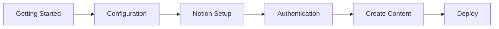

# Next Notion CMS Documentation

Welcome to the comprehensive documentation for Next Notion CMS. This wiki contains everything you need to know about setting up, configuring, and deploying your engineering blogfolio.

## 📚 Documentation Index

### Getting Started

| Document | Description | Difficulty |
|----------|-------------|------------|
| [Getting Started](getting-started.md) | Complete setup guide from scratch | Beginner |
| [Configuration](configuration.md) | All configuration options explained | Beginner |
| [Notion CMS Setup](notion-setup.md) | Step-by-step Notion integration | Intermediate |

### Core Features

| Document | Description | Difficulty |
|----------|-------------|------------|
| [Authentication](authentication.md) | OAuth setup and user management | Intermediate |
| [Architecture](architecture.md) | System design and technical deep-dive | Advanced |
| [Components](components.md) | UI component library reference | Intermediate |
| [Content Management](content-management.md) | Creating and managing content | Beginner |

### Advanced Topics

| Document | Description | Difficulty |
|----------|-------------|------------|
| [Architecture](architecture.md) | System design and technical deep-dive | Advanced |
| [Components](components.md) | UI component library reference | Intermediate |
| [API Reference](api-reference.md) | Available API endpoints | Advanced |

### Deployment & Maintenance

| Document | Description | Difficulty |
|----------|-------------|------------|
| [Deployment](deployment.md) | Production deployment guide | Intermediate |
| [Troubleshooting](troubleshooting.md) | Common issues and solutions | All Levels |
| [Contributing](contributing.md) | Contribution guidelines | All Levels |

---

## 🚀 Quick Start Path

For new users, we recommend following this order:

1. **[Getting Started](getting-started.md)** - Set up your development environment
2. **[Configuration](configuration.md)** - Configure environment variables
3. **[Notion CMS Setup](notion-setup.md)** - Connect Notion as your CMS
4. **[Authentication](authentication.md)** - Set up OAuth providers
5. **[Content Management](content-management.md)** - Create your first post
6. **[Deployment](deployment.md)** - Deploy to production

---

## 📖 By Topic

### Installation & Setup

- [Getting Started](getting-started.md) - Prerequisites, installation, database setup
- [Configuration](configuration.md) - Environment variables and site config
- [Notion CMS Setup](notion-setup.md) - Notion integration and database schema

### Authentication & Users

- [Authentication](authentication.md) - Better Auth, OAuth, RBAC
- [User Dashboard](authentication.md#user-dashboard) - Profile management and preferences

### Content Management

- [Content Management](content-management.md) - Creating blog posts, articles, etc.
- [Notion CMS Setup](notion-setup.md) - Managing content in Notion
- [Authors System](notion-setup.md#authors-database) - Setting up author profiles

### Technical Details

- [Architecture](architecture.md) - System design, data flow, caching
- [Components](components.md) - Reusable UI components
- [API Reference](api-reference.md) - REST endpoints and usage

### Deployment

- [Deployment](deployment.md) - Vercel deployment, custom domains
- [Performance Optimization](deployment.md#performance-optimization) - Speed improvements
- [Monitoring](deployment.md#monitoring) - Analytics and error tracking

### Support

- [Troubleshooting](troubleshooting.md) - Common issues and fixes
- [Contributing](contributing.md) - How to contribute to the project

---

## 🔗 External Resources

- **GitHub Repository**: [prasad-kmd/next-notion-cms](https://github.com/prasad-kmd/next-notion-cms)
- **Next.js Documentation**: [nextjs.org/docs](https://nextjs.org/docs)
- **Better Auth**: [better-auth.com](https://www.better-auth.com/)
- **Supabase**: [supabase.com/docs](https://supabase.com/docs)
- **Notion API**: [developers.notion.com](https://developers.notion.com/)
- **Tailwind CSS**: [tailwindcss.com/docs](https://tailwindcss.com/docs)

---

## 📞 Getting Help

### Community Support

- 💬 [GitHub Discussions](https://github.com/prasad-kmd/next-notion-cms/discussions) - Ask questions
- 🐛 [GitHub Issues](https://github.com/prasad-kmd/next-notion-cms/issues) - Report bugs
- ⭐ [Star on GitHub](https://github.com/prasad-kmd/next-notion-cms/stargazers) - Show support

### Documentation Feedback

Found an issue or have a suggestion? 

- Open an issue with the "documentation" label
- Submit a PR to improve the docs
- Join discussions about documentation improvements

---

## 📝 Documentation Conventions

This documentation uses the following conventions:

| Symbol | Meaning |
|--------|---------|
| ✅ | Recommended / Best Practice |
| ⚠️ | Warning / Caution |
| ❌ | Not Recommended / Avoid |
| 💡 | Tip / Helpful Hint |
| 🔗 | External Link |
| 📁 | File/Directory |
| 🔧 | Configuration |
| 🚀 | Deployment/Production |

### Code Blocks

- `bash` - Shell commands
- `env` - Environment variables
- `typescript` - TypeScript code
- `json` - JSON configuration
- `sql` - SQL queries

---

## 🎯 Learning Paths

### For Developers

1. [Getting Started](getting-started.md)
2. [Architecture](architecture.md)
3. [Components](components.md)
4. [API Reference](api-reference.md)
5. [Contributing](contributing.md)

### For Content Creators

1. [Notion CMS Setup](notion-setup.md)
2. [Content Management](content-management.md)
3. [Authors System](notion-setup.md#authors-database)
4. [SEO Best Practices](content-management.md#seo)

### For DevOps

1. [Deployment](deployment.md)
2. [Configuration](configuration.md)
3. [Monitoring](deployment.md#monitoring)
4. [Troubleshooting](troubleshooting.md)

---

**Last Updated**: April 2025  
**Documentation Version**: 1.0.0  
**Project Version**: See [package.json](../package.json)