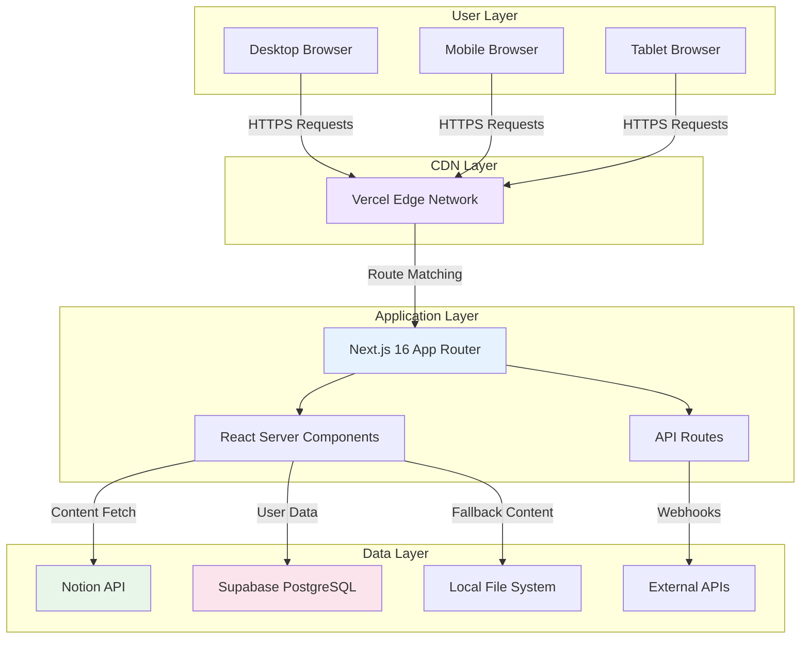
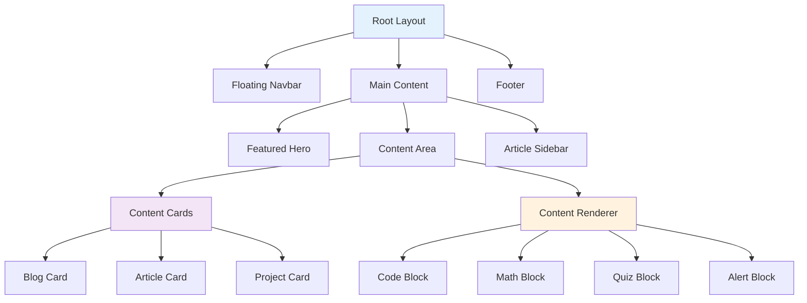
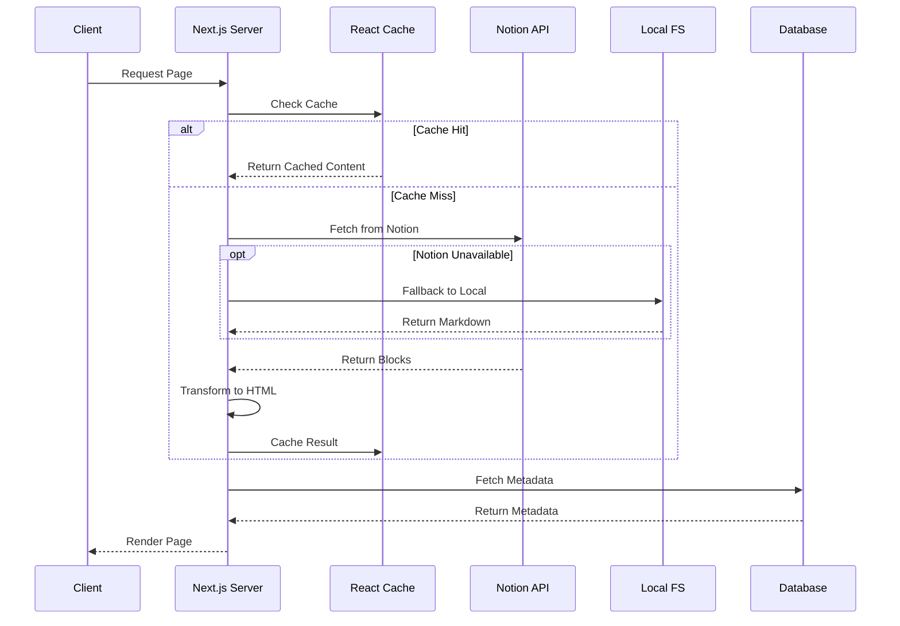
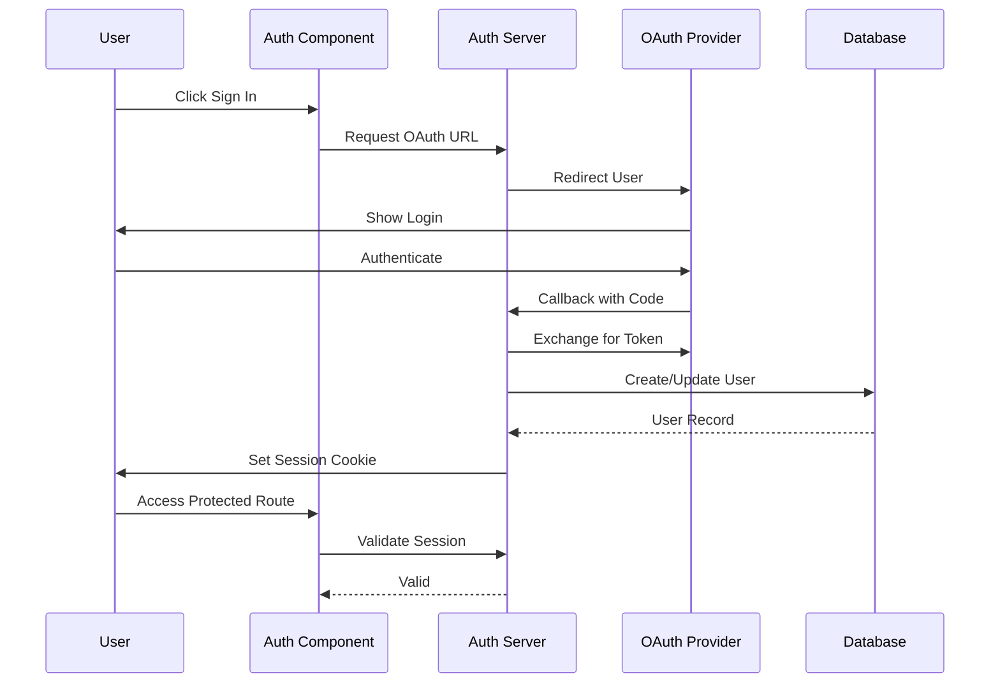
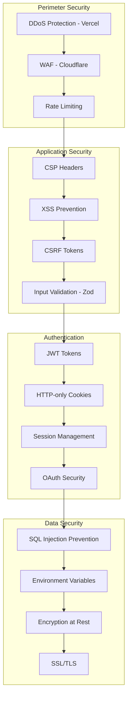

# Architecture Overview

Deep dive into the technical architecture and design decisions of Next Notion CMS.

## Table of Contents

- [System Architecture](#system-architecture)
- [Component Architecture](#component-architecture)
- [Data Flow](#data-flow)
- [Caching Strategy](#caching-strategy)
- [Security Architecture](#security-architecture)
- [Scalability Considerations](#scalability-considerations)
- [Performance Optimizations](#performance-optimizations)

---

## System Architecture

### High-Level Overview

Next Notion CMS follows a **JAMstack-inspired architecture** with server-side rendering capabilities, combining the best of static generation and dynamic content delivery.



### Architectural Principles

1. **Server Components First**: Maximize server-side rendering for better performance and SEO
2. **Progressive Enhancement**: Core functionality works without JavaScript
3. **Edge-Optimized**: Minimize latency through edge deployment
4. **Type Safety**: End-to-end TypeScript for reliability
5. **Separation of Concerns**: Clear boundaries between layers

---

## Component Architecture

### Directory Structure

```
components/
├── ui/                    # Base UI components (buttons, inputs, etc.)
├── auth/                  # Authentication-related components
├── comments/              # Comment system components
├── dashboard/             # Dashboard widgets and layouts
├── quiz-library/          # Quiz interactive components
├── analytics/             # Analytics tracking components
├── layout.tsx             # Main layout wrapper
├── navigation.tsx         # Top navigation bar
├── footer.tsx             # Site footer
├── search.tsx             # Global search modal
├── toc.tsx                # Table of contents
└── content-renderer.tsx   # Markdown/HTML renderer
```

### Component Hierarchy



### Key Components

#### ContentRenderer

The heart of the content display system, responsible for:

- Parsing Markdown/HTML from Notion or local files
- Injecting syntax highlighting via Shiki
- Rendering LaTeX math via KaTeX
- Embedding interactive quizzes
- Processing GitHub-style alerts
- Generating table of contents

```typescript
// Simplified example
interface ContentRendererProps {
  content: string;
  enableToc?: boolean;
  enableQuiz?: boolean;
  enableMath?: boolean;
}

export function ContentRenderer({ 
  content, 
  enableToc = true,
  enableQuiz = true,
  enableMath = true 
}: ContentRendererProps) {
  // Processing pipeline
  const processed = processContent(content, {
    syntaxHighlight: true,
    mathSupport: enableMath,
    quizSupport: enableQuiz,
  });
  
  return <div dangerouslySetInnerHTML={{ __html: processed }} />;
}
```

#### FeaturedHero

A high-performance hero section featuring:

- GSAP-powered carousel animations
- Timed rotation of featured content
- Geometric grid background
- Engineering dashboard aesthetic

---

## Data Flow

### Content Fetching Pipeline



### Authentication Flow



---

## Caching Strategy

### Multi-Layer Caching

| Layer | Technology | TTL | Invalidation |
|-------|-----------|-----|--------------|
| **Browser** | HTTP Cache | 1 year | Cache-Control headers |
| **CDN** | Vercel Edge | 1 year | Deploy-triggered |
| **ISR** | Next.js | 1 hour | Time-based |
| **Memory** | React Cache | Request | Request lifecycle |
| **Database** | Supabase | Configurable | Manual |

### ISR Implementation

```typescript
// app/blog/[slug]/page.tsx
export const revalidate = 3600; // 1 hour

export default async function BlogPost({ params }) {
  const post = await getPost(params.slug);
  // ...
}
```

### Cache Keys

Cache keys are structured for optimal invalidation:

```
notion:blog:{database_id}:{page_id}
notion:articles:{database_id}:{page_id}
user:profile:{user_id}
auth:session:{session_token}
```

---

## Security Architecture

### Defense in Depth



### Security Headers

```typescript
// next.config.mjs
const securityHeaders = [
  {
    key: 'X-DNS-Prefetch-Control',
    value: 'on'
  },
  {
    key: 'Strict-Transport-Security',
    value: 'max-age=63072000; includeSubDomains; preload'
  },
  {
    key: 'X-Frame-Options',
    value: 'SAMEORIGIN'
  },
  {
    key: 'Content-Security-Policy',
    value: cspPolicy
  },
  // ... more headers
];
```

---

## Scalability Considerations

### Horizontal Scaling

- **Stateless Design**: Any server can handle any request
- **Session Storage**: JWT tokens eliminate server-side session storage
- **Database Pooling**: Supabase connection pooling for efficiency

### Vertical Scaling

- **Edge Functions**: Compute-heavy tasks at the edge
- **Server Components**: Reduce client bundle size
- **Image Optimization**: Offload to Vercel Image Optimization

### Bottleneck Analysis

| Potential Bottleneck | Solution |
|---------------------|----------|
| Notion API Rate Limits | React Cache + ISR |
| Database Connections | Connection Pooling |
| Large Images | Next.js Image Optimization |
| Bundle Size | Code Splitting + Tree Shaking |
| Cold Starts | Vercel Pro / Regional Deployment |

---

## Performance Optimizations

### Rendering Optimizations

1. **React Server Components**: Zero bundle size for server components
2. **Streaming SSR**: Progressive page loading
3. **Selective Hydration**: Hydrate visible content first
4. **Concurrent Features**: UseTransition, useDeferredValue

### Asset Optimizations

1. **Image Formats**: AVIF > WebP > JPEG fallback
2. **Font Loading**: `font-display: swap` with preload
3. **CSS Purging**: Tailwind removes unused styles
4. **JavaScript Bundling**: Automatic code splitting

### Network Optimizations

1. **HTTP/2**: Multiplexed requests
2. **Early Hints**: Preload critical assets
3. **Service Worker**: Offline support + caching
4. **Prefetching**: Intelligent link prefetching

### Metrics Targets

| Metric | Target | Current |
|--------|--------|---------|
| Lighthouse Score | 95+ | 95-100 |
| First Contentful Paint | < 1.0s | ~0.8s |
| Largest Contentful Paint | < 2.5s | ~1.5s |
| Time to Interactive | < 3.0s | ~2.0s |
| Cumulative Layout Shift | < 0.1 | < 0.05 |
| Total Blocking Time | < 200ms | ~100ms |

---

## Related Documentation

- [Getting Started](getting-started.md) - Setup guide
- [Deployment](deployment.md) - Production deployment
- [Components](components.md) - Component reference
- [Security](../SECURITY.md) - Security policy

---

**Last Updated**: April 2025  
**Version**: 1.0.0
